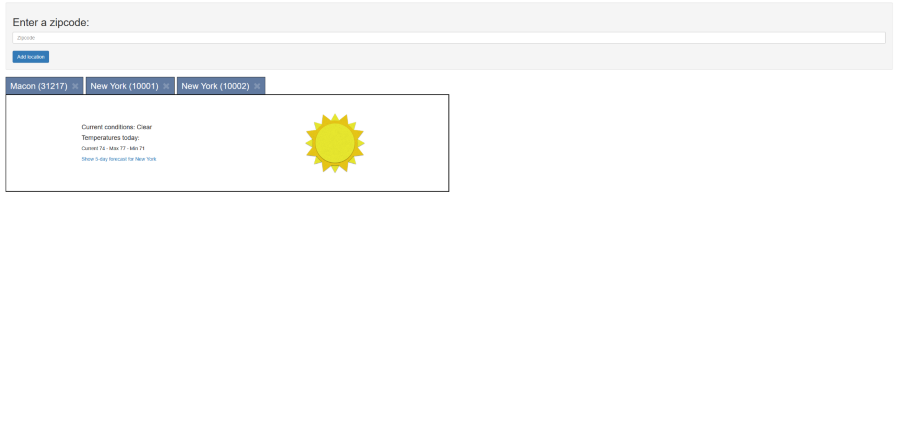

# NgWeather

This project was developed and submitted as part of the requirements for the Angular Level 3 Certification issued by [certificates.dev](https://certificates.dev/).

It is a fork of [`alcfeoh/ng-weather`](https://github.com/alcfeoh/ng-weather) with additional functionalities implemented.

### Notable features:
- A reactive notification system built with RxJS; primarily implemented in [`WeatherService`](./src/app/weather.service.ts) and [`LocationService`](./src/app/location.service.ts).
- A generic and customizable [`TabsComponent`](./src/app/shared/components/tabs/tabs.component.ts), designed to be reusable in any context.
- A simple caching system that leverages localStorage for persistence.

🔗 [**Live demo**](https://ng-cert-lvl-3.vercel.app/)

This project was generated with [Angular CLI](https://github.com/angular/angular-cli) and runs on Angular 17.x.

# STEP \#2 REMARKS FOR EVALUATION

The problem statement mentions: `The parent component doesn’t have to know how to remove a tab or how to
select a tab`.

Please note that I have added an optional feature that allows the app to remember which tab is active even after leaving the page.

This feature is optional and the tabs do not need the parent to manually track the active tab. To make sure of it, you can remove the `select` output and `active` input bindings in `current-conditions.component.html`.

## Development server

Run `ng serve` for a dev server. Navigate to `http://localhost:4200/`. The app will automatically reload if you change any of the source files.

## Code scaffolding

Run `ng generate component component-name` to generate a new component. You can also use `ng generate directive/pipe/service/class/module`.

## Build

Run `ng build` to build the project. The build artifacts will be stored in the `dist/` directory. Use the `-prod` flag for a production build.

## Running unit tests

Run `ng test` to execute the unit tests via [Karma](https://karma-runner.github.io).

## Running end-to-end tests

Run `ng e2e` to execute the end-to-end tests via [Protractor](http://www.protractortest.org/).
Before running the tests make sure you are serving the app via `ng serve`.

## Further help

To get more help on the Angular CLI use `ng help` or go check out the [Angular CLI README](https://github.com/angular/angular-cli/blob/master/README.md).

